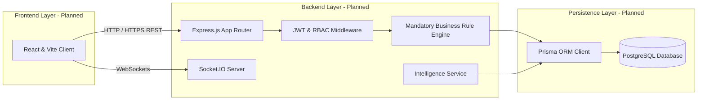
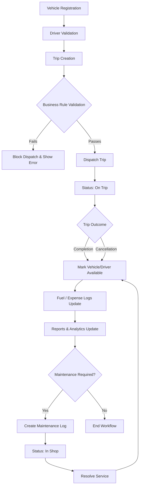

<div align="center">

# TransitOps: Smart Transport Operations Platform

<p align="center">
A centralized, rule-driven, intelligent transport operations platform designed to digitize the lifecycle of fleet assets, driver compliance, dispatch orchestration, and cost analysis.
</p>

[](file:///c:/Users/kakka/OneDrive/Desktop/Odoo/TransitOps/docs/ROADMAP.md)
[](file:///c:/Users/kakka/OneDrive/Desktop/Odoo/TransitOps/LICENSE)

---

[Product Vision](#-product-vision) &bull;
[Problem Statement](#-problem-statement) &bull;
[Platform Capabilities](#-platform-capabilities) &bull;
[Business Rules](#-mandatory-business-rules) &bull;
[Architecture](#-system-architecture) &bull;
[Roadmap](#-development-roadmap) &bull;
[Documentation](#-documentation-directory)

</div>

---

## 🎯 Product Vision

TransitOps transforms fragmented spreadsheet and paper-based transport operations into a centralized, rule-driven, intelligent operations platform. By digitizing key registry data and establishing a server-side business rule engine, the platform enforces compliance, blocks invalid vehicle/driver assignments, monitors maintenance schedules, tracks granular cost elements, and layers in automated recommendation algorithms. 

The platform guarantees operational predictability while preparing logistics teams to shift from reactive firefighting to predictive asset coordination.

---

## ⚠️ Problem Statement

Logistics operations without a unified system of record experience multiple operational bottlenecks:

- **Scheduling Conflicts:** Double-booking of vehicles and drivers leads to idle resources and delayed deliveries.
- **Underutilized Vehicles:** Lack of load-matching visibility causes light cargo loads to consume high-capacity vehicles.
- **Missed Maintenance:** Failure to flag service milestones yields high breakdown frequencies and depreciated asset lifetimes.
- **Expired Driver Licenses:** Assigning drivers with expired/suspended documents poses heavy legal and safety liabilities.
- **Inaccurate Expense Tracking:** Manual logs hide fuel anomalies, pilferage, and bloated cost-per-kilometer statistics.
- **Poor Operational Visibility:** Managers struggle to coordinate without centralized dashboards or real-time status alerts.

---

## ⚙️ Platform Capabilities

### 🔑 Authentication and RBAC
Secure user authentication implementing Role-Based Access Control (RBAC). Dashboards, workflows, and API endpoints are restricted to authorized roles (Fleet Manager, Dispatcher, Safety Officer, Financial Analyst).

### 📊 Fleet Dashboard
Unified operational pane showing real-time Key Performance Indicators (KPIs) such as Active Vehicles, Available Vehicles, Vehicles in Maintenance, Active Trips, Pending Trips, Drivers On Duty, and Fleet Utilization (%). Filterable by vehicle type, status, and region.

### 🚛 Vehicle Registry
Centralized master list capturing Registration Number (validated as unique), Model, Type, Maximum Load Capacity, Odometer, Acquisition Cost, and Status (Available, On Trip, In Shop, Retired).

### 🧑‍✈️ Driver Management
Full driver profiles tracking Name, License Number, License Category, License Expiry Date, Contact Number, Safety Score, and Status (Available, On Trip, Off Duty, Suspended).

### 🗺️ Trip and Dispatch Management
Orchestrated workflow tracking source, destination, cargo weight, planned distance, and current state. Full trip lifecycle tracking from Draft to Dispatched, Completed, or Cancelled.

### 🔧 Maintenance Lifecycle
Centralized maintenance scheduling and tracking. Opening an active service log blocks the vehicle from dispatches, and closing it reinstates the asset.

### ⛽ Fuel and Expense Tracking
Unified logging of fuel fills (liters, cost, dates) and auxiliary operational expenses (tolls, maintenance invoices), dynamically computing total cost of ownership.

### 📈 Reports and Analytics
Calculates macro-analytics including fuel efficiency (distance/fuel), overall asset utilization, operational cost-per-kilometer, and vehicle Return on Investment (ROI). Supporting CSV file export.

---

## 🧠 Intelligence Layer (Planned Capabilities)

To separate TransitOps from basic CRUD forms, the following modular intelligence extensions are planned:

| Feature Module | Description | Implementation Status |
| :--- | :--- | :--- |
| **Computed Driver Safety Score** | Calculates a dynamic 0-100 score based on on-time delivery rate, fuel anomaly occurrences, and duty-hour compliance. | **Planned (Phase 12)** |
| **Dispatch Recommendation Engine** | Compares cargo loads and routes to rank the best driver-vehicle matches by capacity fit and wear-balancing. | **Planned (Phase 12)** |
| **Predictive Maintenance Alerts** | Tracks odometer velocity trends to trigger "Service Due Soon" notices before breakdowns occur. | **Planned (Phase 12)** |
| **Duty-Hour Compliance** | Flags and blocks dispatch assignments for drivers exceeding consecutive driving hours in rolling 24h windows. | **Planned (Phase 12)** |
| **Cost Leakage Detection** | Computes cost-per-km trends and flags anomalous spikes (e.g. fuel theft or inflated service invoices). | **Planned (Phase 12)** |
| **Compliance Document Vault** | Tracks expiry schedules for recurring documents (insurance, PUC, permits) with tiered alert indicators. | **Planned (Phase 12)** |
| **Natural-Language Ops Assistant** | Provides a conversational querying interface for fleet managers to extract metrics in plain text. | **Planned (Phase 12)** |
| **Live Operations Map** | Real-time map displaying mock/simulated GPS coordinates for active dispatches. | **Planned (Phase 12)** |
| **Customer Tracking Link** | Generates shareable, secure, tokenized URLs for customers to monitor live ETAs without logging in. | **Planned (Phase 12)** |

---

## 🛡️ Mandatory Business Rules

TransitOps enforces the following business logic server-side to guarantee system safety and transactional consistency:

```
+--------------------------+     +--------------------------+     +--------------------------+
|    Vehicle Registry      |     |    Driver Management     |     |   Trip Creation Request  |
|  * Plate must be unique  |     |  * Validate license      |     |  * Select source/dest    |
|  * Must be ACTIVE status |     |  * Must be ACTIVE status |     |  * Inputs cargo weight   |
+------------+-------------+     +------------+-------------+     +------------+-------------+
             |                                |                                |
             +-----------------------+--------+--------------------------------+
                                     |
                                     v
                       +-----------------------------+
                       |    Business Rule Engine     |
                       |  - Check vehicle/driver OK? |
                       |  - Cargo <= Max Load?       |
                       |  - Double-booking check?    |
                       +-------------+---------------+
                                     |
                             [Validation Checks]
                                     |
                  +------------------+------------------+
                  | (Pass)                              | (Fail)
                  v                                     v
      +------------------------+              +-------------------+
      |   Allow Dispatch       |              |  Block Dispatch   |
      |   - Vehicle: On Trip   |              |  - Return error   |
      |   - Driver: On Trip    |              +-------------------+
      +------------------------+
```

1. **Unique Registrations:** No two vehicles can be registered with identical plate numbers.
2. **Dispatch Exclusion:** Vehicles marked `In Shop` or `Retired` are blocked from new dispatches.
3. **Driver Vetting:** Drivers with expired licenses or marked `Suspended` are blocked from new dispatches.
4. **No Double-Booking:** Drivers or vehicles currently flagged as `On Trip` are blocked from concurrent assignments.
5. **Capacity Guard:** A trip cannot be dispatched if the cargo weight exceeds the assigned vehicle's maximum load capacity.
6. **Atomic Transitions:** Dispatching a trip automatically transitions the vehicle and driver to `On Trip`. Completing or cancelling the trip automatically reverts them to `Available`.
7. **Maintenance Locks:** Creating an active maintenance record sets the vehicle to `In Shop`. Closing the log restores the vehicle to `Available` (unless status is `Retired`).

---

## 🏗️ System Architecture

TransitOps is designed around a modern, decoupled web architecture. All planned application layers are detailed in the target diagram below:



*Note: The current repository is in **Phase 0** and contains documentation files only. Source code integration will follow in sequential stages.*

---

## 🔄 Operational Workflow

The following flowchart outlines the lifecycle of assets, compliance checks, dispatch actions, and subsequent logs:



---

## 👥 Role Matrix

The target application implements strict separation of duties:

| Role | Operational Scope | Access Level & Intent |
| :--- | :--- | :--- |
| **Fleet Manager** | Full operational visibility and master registry control. | Write permissions on Vehicles/Drivers; read-only access to logs. |
| **Dispatcher / Driver** | Manages dispatch actions, logging execution steps, and capturing load weights. | Write permissions on Trips, Fuel Logs, and Expenses. |
| **Safety Officer** | Monitors safety scores, license expirations, and regulatory compliance. | Write permissions on Driver Compliance/Suspensions. |
| **Financial Analyst** | Reviews operating costs, maintenance logs, ROI metrics, and exports reports. | Read-only access to analytics; CSV export privileges. |

---

## 📋 Feature Status Matrix

| Feature Module | Requirement Type | Status | Phase |
| :--- | :--- | :--- | :--- |
| Project Documentation | Foundation | **Implemented** | Phase 0 |
| Codebase Setup & Prisma Config | Foundation | **Planned** | Phase 1 |
| Authentication & RBAC Checks | Mandatory | **Planned** | Phase 2 |
| KPI Fleet Dashboard | Mandatory | **Planned** | Phase 3 |
| Vehicle Registry CRUD | Mandatory | **Planned** | Phase 4 |
| Driver Management CRUD | Mandatory | **Planned** | Phase 5 |
| Trip Dispatch Lifecycle | Mandatory | **Planned** | Phase 6 |
| Business Rule Checks | Mandatory | **Planned** | Phase 7 |
| Maintenance Records | Mandatory | **Planned** | Phase 8 |
| Fuel & Expense Calculations | Mandatory | **Planned** | Phase 9 |
| Analytics Reports & CSV Export | Mandatory | **Planned** | Phase 10 |
| Bidirectional WebSocket Sync | Bonus | **Planned** | Phase 11 |
| Computed Driver Safety Score | Advanced Differentiator | **Planned** | Phase 12 |
| Recommendation Engine | Advanced Differentiator | **Planned** | Phase 12 |
| Predictive Maintenance | Advanced Differentiator | **Planned** | Phase 12 |
| Duty-Hour Verification | Advanced Differentiator | **Planned** | Phase 12 |
| Cost Leakage Verification | Advanced Differentiator | **Planned** | Phase 12 |
| Document Expiry Vault | Advanced Differentiator | **Planned** | Phase 12 |
| Natural Language Ops Assistant | Advanced Differentiator | **Planned** | Phase 12 |
| Live Operations Map | Advanced Differentiator | **Planned** | Phase 12 |
| Customer Tracking Link | Advanced Differentiator | **Planned** | Phase 12 |

---

## 🛠️ Technology Stack (Target)

The platform is designed to compile with the following primary tools and framework layers:

<table>
  <tr>
    <td align="center" width="96">
      
      <br />React
    </td>
    <td align="center" width="96">
      
      <br />Vite
    </td>
    <td align="center" width="96">
      
      <br />Node.js
    </td>
    <td align="center" width="96">
      
      <br />Express
    </td>
    <td align="center" width="96">
      
      <br />PostgreSQL
    </td>
    <td align="center" width="96">
      
      <br />Prisma
    </td>
    <td align="center" width="96">
      
      <br />Socket.IO
    </td>
    <td align="center" width="96">
      
      <br />JWT
    </td>
  </tr>
</table>

---

## 📁 Repository Structure

The current structure contains only configuration files, directory setups, and documentation. No project application code is initialized.

```
TransitOps/
├── docs/
│   ├── ARCHITECTURE.md                  # System design and database flow architecture
│   ├── ROADMAP.md                       # Development timelines and milestones
│   ├── TransitOps_PRD.pdf               # Original Product Requirements Document
│   └── TransitOps_Problem_Statement.pdf # Official Odoo hackathon problem statement
├── .gitignore                           # Excluded project files config
├── CODE_OF_CONDUCT.md                   # Contributor Covenant CoC standard
├── CONTRIBUTING.md                      # Code format guidelines, branching, and commit conventions
├── LICENSE                              # Project license guidelines
├── README.md                            # Project landing documentation
├── SECURITY.md                          # Vulnerability reporting structures
└── TEAM.md                              # Development team roles and philosophies
```

---

## 🚀 Development Roadmap

Development transitions in phases matching [ROADMAP.md](file:///c:/Users/kakka/OneDrive/Desktop/Odoo/TransitOps/docs/ROADMAP.md):

- **Phase 0 — Repository documentation and standards:** (Active)
- **Phases 1 to 2 — Project foundation, Auth and RBAC:** Setup workspaces and routing validation middleware.
- **Phases 3 to 6 — Registries & Lifecycles:** Configure vehicle, driver, and trip dispatch schemas.
- **Phase 7 — Business Rule Engine:** Build validation logic covering capacities and availability criteria.
- **Phases 8 to 10 — Cost logs & Reporting:** Build maintenance, expense, and CSV export modules.
- **Phases 11 to 13 — WebSockets, Intelligence Layer, and Deployment:** Layer real-time notifications, recommendations, predictive tracking, document expletives, and Cypress test suites.

Refer to [docs/ROADMAP.md](file:///c:/Users/kakka/OneDrive/Desktop/Odoo/TransitOps/docs/ROADMAP.md) for full acceptance checklists per phase.

---

## 👥 Team

- **Rachit Kakkad** &mdash; Team Lead / Core Developer
- **Nishit Doshi** &mdash; Core Developer
- **Tapan Vachhani** &mdash; Core Developer
- **Harshit Kumar** &mdash; Core Developer

Refer to [TEAM.md](file:///c:/Users/kakka/OneDrive/Desktop/Odoo/TransitOps/TEAM.md) for a detailed list of individual priorities.

---

## 📖 Documentation Directory

- [Product Requirements Document (PRD)](file:///c:/Users/kakka/OneDrive/Desktop/Odoo/TransitOps/docs/TransitOps_PRD.pdf)
- [Official Problem Statement](file:///c:/Users/kakka/OneDrive/Desktop/Odoo/TransitOps/docs/TransitOps_Problem_Statement.pdf)
- [Architecture & Data Flows](file:///c:/Users/kakka/OneDrive/Desktop/Odoo/TransitOps/docs/ARCHITECTURE.md)
- [Development Roadmap](file:///c:/Users/kakka/OneDrive/Desktop/Odoo/TransitOps/docs/ROADMAP.md)
- [Team Roles](file:///c:/Users/kakka/OneDrive/Desktop/Odoo/TransitOps/TEAM.md)
- [Contributing Standards](file:///c:/Users/kakka/OneDrive/Desktop/Odoo/TransitOps/CONTRIBUTING.md)
- [Code of Conduct](file:///c:/Users/kakka/OneDrive/Desktop/Odoo/TransitOps/CODE_OF_CONDUCT.md)
- [Security Policy](file:///c:/Users/kakka/OneDrive/Desktop/Odoo/TransitOps/SECURITY.md)

---

## 🤝 Contributing

Contributions must follow the branch naming and commit rules in [CONTRIBUTING.md](file:///c:/Users/kakka/OneDrive/Desktop/Odoo/TransitOps/CONTRIBUTING.md). Direct code updates without PR reviews are prohibited.

---

## 📄 License

This project is licensed under the MIT License - see the [LICENSE](file:///c:/Users/kakka/OneDrive/Desktop/Odoo/TransitOps/LICENSE) file for details.
