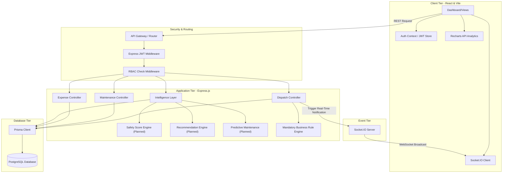
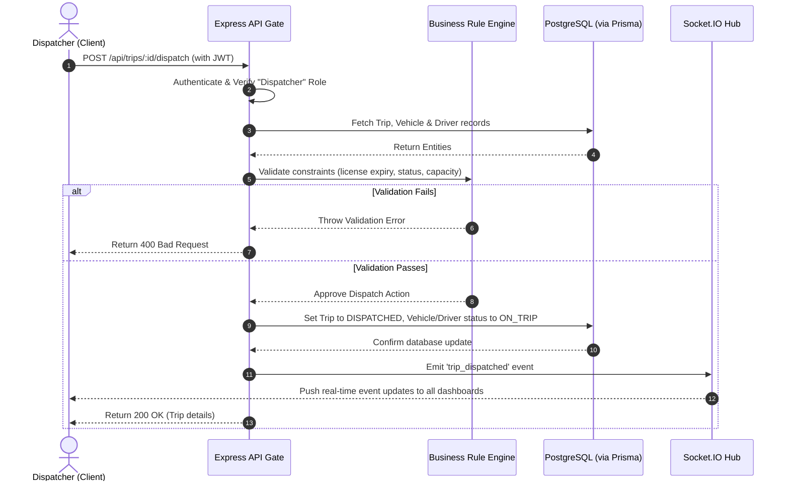

# TransitOps Technical Architecture

This document describes the architectural design for **TransitOps** — the Smart Transport Operations Platform. It outlines the current project state (documentation only) versus the target development system architecture, component responsibilities, data flows, and design decisions.

---

## 1. System Overview & Evolution

TransitOps is evolving from its current initial state to a fully-realized production-grade ERP/SaaS logistics platform:

```
[Phase 0: Current State] ──> [Target Development Architecture]
  - Documentation Only         - React/Vite Frontend
  - Standard Config Files      - Node/Express REST API
  - Zero Dependencies          - PostgreSQL Persistence via Prisma ORM
                               - Socket.IO Bidirectional Layer
                               - Core Intelligence/Scoring Modules
```

---

## 2. Target Component Architecture

The target architecture is structured as a decoupled, multi-tier system designed to ensure high performance, predictability, and complete verification of business rules:



### 2.1 Frontend Layer *(Planned)*
- **Framework**: React 18 initialized via Vite.
- **Styling**: Vanilla CSS for maximum flexibility and performance.
- **Analytics**: Recharts to plot statistics such as fuel efficiency trends, asset utilization, and ROI logs.
- **State Management**: React Context for user sessions, authentication tokens, and theme settings (dark/light support).
- **Communication**: Axios for HTTP REST requests; `socket.io-client` for bidirectional, live socket events.

### 2.2 Backend/API Layer *(Planned)*
- **Runtime**: Node.js (version 20+).
- **Web Framework**: Express.js with a modular controller structure.
- **REST Endpoints**: CRUD endpoints for vehicles, drivers, maintenance logs, and expenses. State mutation actions for dispatches (create, dispatch, complete, cancel).
- **Authentication**: JWT-based stateless authentication. Custom token verification middleware.
- **Role-Based Access Control (RBAC)**: Gated route access. Handlers check role permissions before execution.
- **Event Gateway**: Socket.IO server to broadcast priority events (dispatch updates, anomalies, compliance alerts) to connected clients.

### 2.3 Persistence Layer *(Planned)*
- **Database**: PostgreSQL (version 15+).
- **ORM**: Prisma ORM.
- **Database Schema**: Structured relations with primary/foreign keys and indexes on fast-access fields (e.g. vehicle plate registrations, driver license numbers, trip statuses).

### 2.4 Intelligence & Rule Engine Layer *(Planned)*
- **Business Rule Engine**: Dedicated backend validation module. Enforces all mandatory rules prior to writing changes to the database.
- **Safety Score Engine**: Computes normalized safety values based on duty-hour breaches, fuel anomalies, and incidents.
- **Dispatch Recommendation Engine**: Computes composite fitness scores matching available vehicles and drivers.
- **Predictive Maintenance**: Analyzes odometer changes against target intervals to forecast next service schedules.
- **Natural-Language Ops Assistant**: LLM-backed query parser translating text questions into structured database queries.

---

## 3. Data Flows

### 3.1 Trip Dispatch Workflow

This flow details the data interactions during a dispatch attempt:



---

## 4. Key Architectural Principles

1. **Strict Server-Side Enforcement**: Frontends are for presentation and convenience. No business rule validation can be deferred to client validation.
2. **Transactional Consistency**: Multi-table status changes (e.g. completing a trip, updating odometers, and reverting statuses to Available) must run within SQL transactions.
3. **Stateless Scalability**: Session state is not stored in memory on the backend. Verification is performed using signed JWT tokens.
4. **Graceful Failbacks**: Intelligence components (such as recommendations and predictive alerts) must operate as non-blocking modules. If an intelligence calculation fails, the core registry operations must remain functional.
