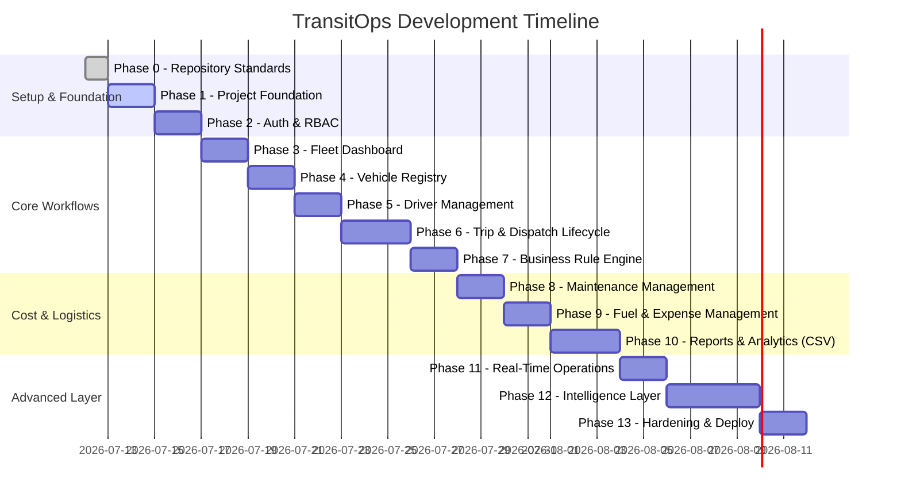

# TransitOps Development Roadmap

This document outlines the structured, feature-by-feature development roadmap for **TransitOps** — the Smart Transport Operations Platform. It contains the objectives, deliverables, dependencies, and acceptance criteria for each phase.

---

## Roadmap Overview

---

## Phase 0 — Repository Documentation and Standards
- **Objective**: Establish community, documentation, and licensing standards.
- **Deliverables**:
  - Comprehensive `README.md`, `CONTRIBUTING.md`, `CODE_OF_CONDUCT.md`, `SECURITY.md`, `TEAM.md`, `LICENSE`, and `.gitignore`.
  - Target architectures (`docs/ARCHITECTURE.md`) and Gantt-based project planning (`docs/ROADMAP.md`).
- **Dependencies**: None.
- **Acceptance Criteria**:
  - Documentation committed to the repository with no source code.
  - No references to non-existent source directories or incorrect file links.

## Phase 1 — Project Foundation
- **Objective**: Bootstrap the frontend and backend project repositories.
- **Deliverables**:
  - React/Vite development server workspace in `/frontend`.
  - Node/Express REST API in `/backend` configured with PostgreSQL connection.
  - Setup Prisma schemas and default configuration setups.
- **Dependencies**: Phase 0.
- **Acceptance Criteria**:
  - Frontend development server boots on standard port (`5173` / `3000`).
  - Backend database connects via environment variables and executes dry run migration.

## Phase 2 — Authentication and RBAC
- **Objective**: Implement secure user registry, login, and authorization middleware.
- **Deliverables**:
  - Backend login endpoints hashing passwords with `bcrypt` and returning JSON Web Tokens (JWT).
  - Role-Based Access Control (RBAC) middleware validating claims on restricted routes.
  - Frontend authentication forms (Login page) persisting session state.
- **Dependencies**: Phase 1.
- **Acceptance Criteria**:
  - Only authenticated requests access restricted endpoints.
  - Users with specific roles are barred from restricted API endpoints with `403 Forbidden`.

## Phase 3 — Fleet Dashboard
- **Objective**: Build the centralized key performance indicator view for operators.
- **Deliverables**:
  - High-level KPI widgets tracking Active Vehicles, Available Vehicles, Vehicles in Maintenance, Active Trips, Pending Trips, Drivers On Duty, and Fleet Utilization (%).
  - Filtering layers allowing queries by vehicle type, status, and region.
- **Dependencies**: Phase 2.
- **Acceptance Criteria**:
  - UI displays metrics matching backend aggregation accurately.
  - Filtering options apply criteria dynamically without breaking state.

## Phase 4 — Vehicle Registry
- **Objective**: Create the system of record for fleet physical assets.
- **Deliverables**:
  - Vehicle database entities supporting: Registration Number, Model, Type, Maximum Load Capacity, Odometer, Acquisition Cost, and Status.
  - CRUD interface restricted to Fleet Managers.
- **Dependencies**: Phase 3.
- **Acceptance Criteria**:
  - Registration numbers must be validated as unique at the database/API level.
  - Status updates successfully transition between: `Available`, `On Trip`, `In Shop`, and `Retired`.

## Phase 5 — Driver Management
- **Objective**: Track driver metadata, statuses, and safety records.
- **Deliverables**:
  - Driver records schema including: Name, License Number, License Category, License Expiry Date, Contact Number, Safety Score, and Status.
  - Management views restricted to Safety Officers and Fleet Managers.
- **Dependencies**: Phase 4.
- **Acceptance Criteria**:
  - Prevent creating records with incomplete compliance data (e.g. missing license details).
  - Status transitions successfully map to: `Available`, `On Trip`, `Off Duty`, and `Suspended`.

## Phase 6 — Trip and Dispatch Lifecycle
- **Objective**: Establish trip management workflows.
- **Deliverables**:
  - Trip schema capturing source, destination, assigned vehicle, assigned driver, cargo weight, and planned distance.
  - Trip management views mapping state transitions: `Draft` &rarr; `Dispatched` &rarr; `Completed` or `Cancelled`.
- **Dependencies**: Phase 5.
- **Acceptance Criteria**:
  - Trips default to `Draft`.
  - Dispatch transitions trigger operational checks.

## Phase 7 — Mandatory Business Rule Engine
- **Objective**: Automate and enforce hard business rules on dispatches server-side.
- **Deliverables**:
  - Validation engine blocking dispatches for Retired/In Shop vehicles.
  - Validation engine blocking dispatches for expired license or Suspended drivers.
  - Check validation preventing double-booking of On Trip vehicles or drivers.
  - Check validation blocking cargo weight exceeding vehicle capacity.
  - Automated state transitions: dispatching sets vehicle and driver to `On Trip`; completion or cancellation reverts them to `Available`.
- **Dependencies**: Phase 6.
- **Acceptance Criteria**:
  - Automated database tests verify that rule violations block transaction with `400 Bad Request`.
  - Successful dispatch automatically updates dependent entities' status immediately.

## Phase 8 — Maintenance Management
- **Objective**: Track vehicle service records and manage shop stays.
- **Deliverables**:
  - Maintenance records schema (Vehicle, Type, Description, Cost, Opened/Closed Dates, Status).
  - Validation: opening an active maintenance log automatically sets vehicle status to `In Shop`.
  - Validation: closing maintenance log restores vehicle to `Available` (unless `Retired`).
- **Dependencies**: Phase 7.
- **Acceptance Criteria**:
  - Adding a vehicle to a maintenance record removes it from the dispatcher's selection pool.
  - Resolving a maintenance record returns the vehicle to service eligibility automatically.

## Phase 9 — Fuel and Expense Management
- **Objective**: Capture and compute operational expense details.
- **Deliverables**:
  - Fuel logs (liters, cost, date) and auxiliary expenses (tolls, maintenance costs) mapping to vehicles.
  - Automated computation aggregating Total Operational Cost (Fuel + Maintenance costs).
- **Dependencies**: Phase 8.
- **Acceptance Criteria**:
  - Expenses update calculations for total cost of ownership.
  - Adding maintenance records updates the vehicle's associated cost.

## Phase 10 — Reports, Analytics, ROI and CSV Export
- **Objective**: Generate operational metrics, financial analyses, and file exports.
- **Deliverables**:
  - Aggregated analytics panels showing Fuel Efficiency (Distance / Fuel), Fleet Utilization (%), and Operational Cost per vehicle.
  - ROI calculator implementing: `ROI = (Revenue - (Maintenance + Fuel)) / Acquisition Cost`.
  - CSV export engine for custom date ranges.
- **Dependencies**: Phase 9.
- **Acceptance Criteria**:
  - CSV export output contains correct and uncorrupted column data.
  - ROI calculations correctly execute order of operations: subtract costs from revenue, divide by acquisition.

## Phase 11 — Real-Time Operations
- **Objective**: Implement bidirectional notifications and map updates.
- **Deliverables**:
  - Socket.IO gateway on the backend with client listeners on frontend.
  - Real-time notification banners for dispatch changes and dashboard statistics.
- **Dependencies**: Phase 10.
- **Acceptance Criteria**:
  - Dashboard stats update dynamically when other clients perform actions.
  - Sockets handle connection drops gracefully without reloading the browser.

## Phase 12 — Advanced Intelligence Features
- **Objective**: Layer intelligence tools over baseline operations.
- **Deliverables**:
  - **Computed Safety Score Engine**: Weighted calculation (On-Time Rate (35%) + Incident-Free Rate (30%) + Duty-Hour Compliance (20%) + Fuel-Anomaly-Free Rate (15%)) normalized to a 0-100 scale.
  - **Dispatch Recommendation Engine**: Composite scoring ranking matching drivers and vehicles.
  - **Predictive Maintenance**: Alerts based on odometer trend velocity vs maintenance intervals.
  - **Duty-Hour Compliance**: 10-hour maximum threshold checking consecutive driving hours within a rolling 24-hour window.
  - **Cost Leakage Detection**: Alerts flagging vehicles exceeding standard-deviation thresholds in cost-per-km.
  - **Compliance Vault**: Calendar view tracking recurring vehicle/driver documents (insurance, PUC, fitness).
  - **Natural-Language Ops Assistant**: LLM/structured query interface for plain-text analytics.
- **Dependencies**: Phase 11.
- **Acceptance Criteria**:
  - Safety score updates automatically after related trips/incident completions.
  - Natural-language assistant fails gracefully with predefined fallback responses.

## Phase 13 — Testing, Hardening and Deployment
- **Objective**: Run system checks, write integrations, and prepare cloud deployment.
- **Deliverables**:
  - End-to-end user tests using Cypress.
  - Production build optimizations.
  - Production server provisioning and environment setup.
- **Dependencies**: Phase 12.
- **Acceptance Criteria**:
  - Critical workflows achieve 100% test pass rate.
  - Responsive layout renders correctly across mobile and desktop viewport sizes.
